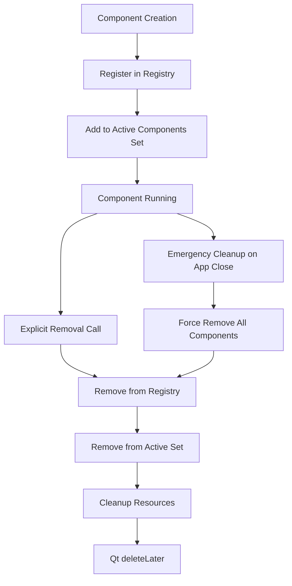
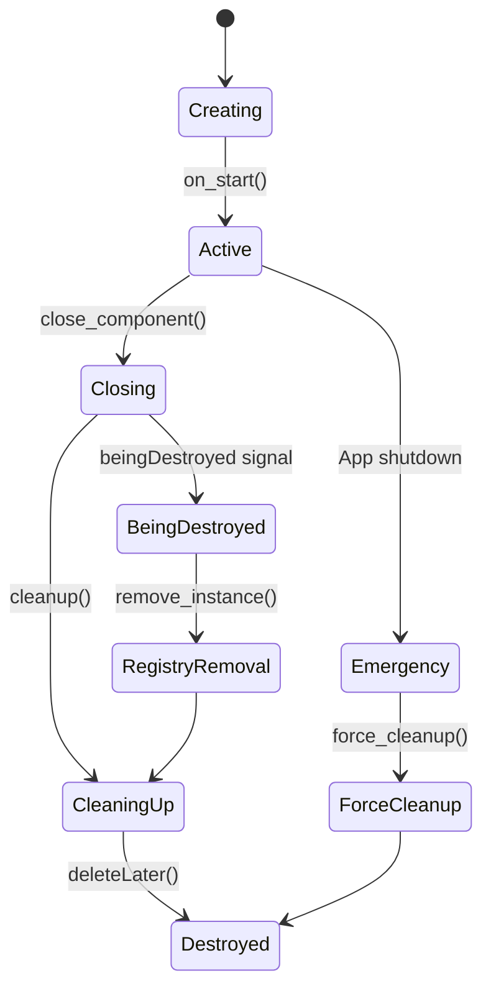

# Component Lifecycle Management - Comprehensive Analysis & Action Plan

## Root Cause Analysis

I've identified several critical issues in the current component lifecycle management:

### 1. Unreliable `on_destroy` Invocation
- The [`on_destroy`](app.py:764) method relies on Qt's `destroyed` signal, which may not fire if:
  - Circular references prevent garbage collection
  - Qt's object tree cleanup fails
  - Python's garbage collector doesn't run immediately

### 2. Obsolete `remove_instance` Implementation
- The current [`remove_instance`](app.py:398) method directly manipulates the registry's instances dictionary
- It's only called from [`on_destroy`](app.py:767), creating a single point of failure
- No fallback mechanism exists if `on_destroy` never fires

### 3. Inconsistent Lifecycle Patterns
- [`QueryComponent`](query/query_component.py:82) implements a robust [`beingDestroyed`](query/query_component.py:98) signal pattern
- Other components like [`ValidationManagerComponent`](validation_manager/validation_manager_component.py:28) lack this pattern
- No standardized lifecycle management across the application

### 4. Memory Leak Symptoms
- Components remain in the [`APP_COMPONENT_REGISTRY`](component_registry.py:187) after they should be destroyed
- Strong references in the registry prevent garbage collection
- Accumulated instances cause memory leaks over time

## Detailed Solution Plan

### Phase 1: Enhanced Component Registry



#### 1.1 Registry Enhancements
- Add weak reference support to prevent circular references
- Implement explicit removal methods that don't rely on Qt signals
- Add component tracking and health monitoring
- Create emergency cleanup procedures for application shutdown

#### 1.2 New Registry Methods
```python
def remove_component_instance(self, component_name: str, instance_name: str) -> bool
def force_cleanup_all_instances(self) -> None
def get_active_instances(self) -> Dict[str, List[str]]
def validate_registry_integrity(self) -> List[str]  # Returns issues found
```

### Phase 2: Standardized Component Lifecycle



#### 2.1 Enhanced AppComponent Base Class
- Add mandatory `beingDestroyed` signal to all components
- Implement explicit cleanup lifecycle phases
- Add component state tracking (ACTIVE, CLOSING, DESTROYED)
- Create standardized resource cleanup patterns

#### 2.2 Lifecycle Improvements
```python
class ComponentState(Enum):
    ACTIVE = "active"
    CLOSING = "closing"
    DESTROYED = "destroyed"

class AppComponent(qc.QObject):
    beingDestroyed = qc.Signal(str, str)  # component_name, instance_name
    
    def __init__(self, app: App, instance_name: str):
        # ... existing init ...
        self._lifecycle_state = ComponentState.ACTIVE
        
    def close_component(self):
        if self._lifecycle_state != ComponentState.ACTIVE:
            return  # Already closing/closed
            
        self._lifecycle_state = ComponentState.CLOSING
        self.beingDestroyed.emit(self.component_name, self.instance_name)
        # ... rest of close logic
```

### Phase 3: Proactive Cleanup Management

#### 3.1 App-Level Cleanup Coordinator
```python
class ComponentLifecycleManager:
    def __init__(self, app: App):
        self.app = app
        self.cleanup_timeout = 5000  # 5 seconds
        
    def schedule_component_removal(self, component: AppComponent):
        # Immediate removal from registry
        # Scheduled Qt cleanup with timeout
        # Fallback forced cleanup if timeout exceeded
        
    def emergency_shutdown_cleanup(self):
        # Force cleanup all components on app close
        # Don't rely on Qt signals during shutdown
```

#### 3.2 Connection Management
- Use weak signal connections where appropriate
- Implement explicit disconnection in cleanup phases
- Add connection tracking for debugging

### Phase 4: Implementation Strategy

#### 4.1 Backward Compatibility
- Keep existing APIs functional during transition
- Add deprecation warnings for old patterns
- Gradual migration of components to new lifecycle

#### 4.2 Testing & Validation
- Component lifecycle unit tests
- Memory leak detection tests
- Stress testing with rapid component creation/destruction
- Shutdown sequence testing

#### 4.3 Monitoring & Debugging
- Enhanced logging for component lifecycle events
- Registry integrity validation tools
- Memory usage monitoring
- Component reference tracking for debugging

## Implementation Priority

### 1. High Priority - Fix immediate memory leaks:
- Enhance [`remove_instance`](app.py:398) to work without relying on `on_destroy`
- Add explicit cleanup in [`on_close`](app.py:672)
- Implement emergency shutdown cleanup
- Add `beingDestroyed` signal to base AppComponent class

### 2. Medium Priority - Standardize lifecycle:
- Add `beingDestroyed` signal to all components
- Enhance component base class with state tracking
- Implement proactive cleanup manager
- Update component registry with explicit removal methods

### 3. Low Priority - Advanced features:
- Weak reference support in registry
- Advanced monitoring and debugging tools
- Performance optimizations

## Expected Outcomes

- **Eliminate memory leaks** by ensuring components are properly removed from registry
- **Improve application shutdown** with reliable cleanup procedures
- **Standardize component lifecycle** across all components
- **Enhanced debugging capabilities** for component lifecycle issues
- **Better resource management** with proactive cleanup strategies

## Critical Code Changes Required

### 1. App.remove_instance() Enhancement
Current implementation only removes from registry. Need to:
- Make it callable without relying on `on_destroy`
- Add logging and validation
- Handle edge cases (component already removed, etc.)

### 2. AppComponent.close_component() Enhancement
Current implementation calls cleanup() then deleteLater(). Need to:
- Add `beingDestroyed` signal emission
- Call `app.remove_instance()` explicitly before Qt cleanup
- Add state tracking to prevent double-cleanup

### 3. App.on_close() Enhancement
Current implementation only emits `application_closing` signal. Need to:
- Add explicit component cleanup loop
- Force removal of all components from registry
- Add timeout-based cleanup for stuck components

### 4. Component Registry Enhancement
Current implementation stores strong references. Need to:
- Add explicit removal methods
- Add registry integrity validation
- Add emergency cleanup capabilities

## Implementation Notes

- Start with high-priority fixes to address immediate memory leaks
- Maintain backward compatibility during transition
- Add comprehensive logging for debugging lifecycle issues
- Test with rapid component creation/destruction scenarios
- Ensure proper cleanup during abnormal application termination