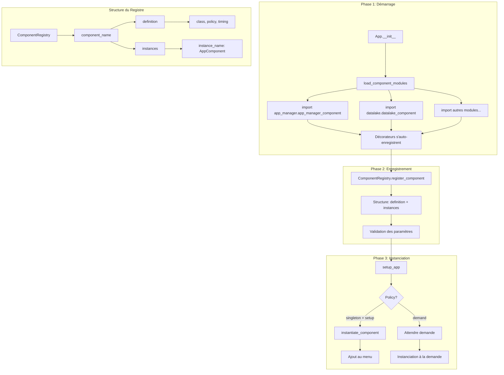

# Plan de Refactoring du Système de Composants

## Vue d'Ensemble

Ce document détaille le plan de refactoring pour résoudre les problèmes d'enregistrement et d'instanciation des composants dans l'application, tout en maintenant la compatibilité avec Nuitka.

## Problèmes Identifiés

### 1. Incohérences dans la Définition des Décorateurs

**Problème** : Syntaxe incohérente entre les composants
- [`app_manager_component.py:6`](app_manager/app_manager_component.py:6) : `@register_app_component(name="app-manager", ...)`
- [`filters_component.py:7`](filters/filters_component.py:7) : `@register_app_component("filters", ...)`

### 2. Structure du Registre Incohérente

**Problème** : Désalignement entre enregistrement et utilisation
- [`component_registry.py:25`](component_registry.py:25) enregistre : `{"class": cls, "instantiation_policy": policy, ...}`
- [`app.py:102`](app.py:102) s'attend à : `component["definition"]["instantiation_policy"]`

### 3. Imports Manuels Incompatibles avec Nuitka

**Problème** : [`App.register_components()`](app.py:55) utilise des imports manuels
- Non compatible avec la compilation Nuitka
- Nécessite un système d'auto-enregistrement statique

## Architecture Proposée



## Plan d'Implémentation

### Phase 1 : Standardisation du Décorateur

#### 1.1. Nouveau Décorateur Unifié

**Fichier** : [`component_registry.py`](component_registry.py)

```python
def register_app_component(
    name: str,
    policy: str = "singleton", 
    instantiation_time: str = "setup"
) -> Callable:
    """
    Enregistre un composant dans le registre global.
    
    Args:
        name: Nom unique du composant
        policy: "singleton" | "multi" - Politique d'instanciation
        instantiation_time: "setup" | "demand" - Moment d'instanciation
    """
    # Validation des paramètres
    if policy not in ["singleton", "multi"]:
        raise ValueError(f"Policy '{policy}' invalide. Valeurs autorisées: singleton, multi")
    
    if instantiation_time not in ["setup", "demand"]:
        raise ValueError(f"Instantiation time '{instantiation_time}' invalide. Valeurs autorisées: setup, demand")
    
    def decorator(cls: type) -> type:
        # Structure corrigée pour correspondre aux attentes d'App
        APP_COMPONENT_REGISTRY.register_component(
            name,
            {
                "definition": {
                    "class": cls,
                    "instantiation_policy": policy,
                    "instantiate_on": instantiation_time,
                },
                "instances": {}
            }
        )
        return cls
    
    return decorator
```

#### 1.2. Mise à Jour des Composants

**Syntaxe standardisée pour tous les composants** :
```python
@register_app_component(
    name="component_name",
    policy="singleton",              # ou "multi"
    instantiation_time="setup"       # ou "demand"
)
class ComponentClass(app.AppComponent):
    # ...
```

### Phase 2 : Correction de la Structure du Registre

#### 2.1. Nouvelle Structure

```python
{
    "component_name": {
        "definition": {
            "class": ComponentClass,
            "instantiation_policy": "singleton|multi",
            "instantiate_on": "setup|demand"
        },
        "instances": {
            "instance_name": AppComponentInstance
        }
    }
}
```

#### 2.2. Mise à Jour de ComponentRegistry

```python
class ComponentRegistry(QObject):
    def register_component(self, name: str, component_data: dict):
        """
        Enregistre un composant avec la structure attendue par App.
        
        Args:
            name: Nom du composant
            component_data: Structure complète avec definition et instances
        """
        if name in self.registry:
            logger.warning(f"Composant '{name}' déjà enregistré, remplacement...")
        
        self.registry[name] = component_data
        logger.debug(f"Composant '{name}' enregistré avec succès")
```

### Phase 3 : Remplacement des Imports Manuels

#### 3.1. Nouvelle Méthode dans App

```python
def load_component_modules(self):
    """
    Charge tous les modules de composants de manière explicite.
    Compatible avec Nuitka car utilise des imports statiques.
    """
    # Liste explicite pour la compatibilité Nuitka
    import app_manager.app_manager_component
    import datalake.datalake_component
    import fields.fields_component
    import filters.filters_component
    import order_by.order_by_component
    import query.query_component
    import query_manager.query_manager_component
    import validation_manager.validation_manager_component
    import generic_explorer.generic_explorer_component
    
    logger.info(f"Modules de composants chargés: {len(self.components)} composants enregistrés")
```

#### 3.2. Modification du Constructeur App

```python
def __init__(self, app_options: dict = None):
    super().__init__()
    self.main_window = mw.MainWindow(self)
    self.main_window.closing.connect(self.on_close)

    self.app_options: dict = app_options or {}
    self.missing_translations = set()
    
    # Chargement des traductions
    self.load_translations()

    # Initialisation du conteneur de composants
    self.components: dict[str, dict[str, Union[dict, AppComponent]]] = {}

    # Chargement et enregistrement automatique des composants
    self.load_component_modules()

    # Instanciation des composants selon leur politique
    self.setup_app()

    # Démarrage des connexions entre composants
    self.start()
```

### Phase 4 : Amélioration de la Gestion des Instances

#### 4.1. Unification de la Logique d'Instanciation

```python
def instantiate_component(
    self,
    component_name: str,
    instance_name: str = None,
) -> AppComponent:
    """
    Instancie un composant selon sa politique définie.
    
    Args:
        component_name: Nom du composant à instancier
        instance_name: Nom de l'instance (optionnel pour les singletons)
    
    Returns:
        AppComponent: Instance créée ou existante
    """
    if component_name not in self.components:
        logger.error(f"Composant '{component_name}' non enregistré")
        return None
        
    component_data = self.components[component_name]
    definition = component_data["definition"]
    instances = component_data["instances"]
    policy = definition["instantiation_policy"]
    
    # Gestion des politiques
    if policy == "singleton":
        instance_name = component_name  # Nom fixe pour les singletons
        if instance_name in instances:
            logger.debug(f"Retour de l'instance singleton existante: {component_name}")
            return instances[instance_name]
    
    elif policy == "multi":
        if not instance_name:
            raise ValueError(f"Instance name requis pour le composant multi '{component_name}'")
        if instance_name in instances:
            logger.debug(f"Retour de l'instance existante: {instance_name}")
            return instances[instance_name]
    
    # Création de la nouvelle instance
    component_class = definition["class"]
    instance = component_class(self, instance_name or component_name)
    
    # Connexions automatiques
    instance.broadcast.connect(self.dispatch_broadcast)
    self.broadcast_dispatcher.connect(instance.generic_receiver)
    self.application_closing.connect(instance.close_component)
    
    # Enregistrement
    instances[instance_name or component_name] = instance
    logger.info(f"Instance créée: {component_name}/{instance_name or component_name}")
    
    return instance
```

#### 4.2. Simplification de setup_app

```python
def setup_app(self):
    # Configuration des actions de base
    self._setup_base_actions()
    
    # Instanciation automatique des composants "setup"
    for component_name, component_data in self.components.items():
        definition = component_data["definition"]
        if (definition["instantiate_on"] == "setup" and 
            definition["instantiation_policy"] == "singleton"):
            
            instance = self.instantiate_component(component_name)
            self._setup_component_menu(instance)
    
    logger.info(f"Setup terminé: {len(self.components)} composants enregistrés")
```

### Phase 5 : Migration des Composants Existants

#### 5.1. Liste des Composants à Migrer

| Composant          | Fichier                                                                                 | Syntax Actuelle        | Policy    | Timing |
| ------------------ | --------------------------------------------------------------------------------------- | ---------------------- | --------- | ------ |
| app-manager        | [`app_manager_component.py`](app_manager/app_manager_component.py)                      | `name="app-manager"`   | singleton | setup  |
| query              | [`query_component.py`](query/query_component.py)                                        | `name="query"`         | multi     | demand |
| fields             | [`fields_component.py`](fields/fields_component.py)                                     | `"fields"`             | multi     | demand |
| datalake           | [`datalake_component.py`](datalake/datalake_component.py)                               | `"datalake"`           | singleton | setup  |
| order_by           | [`order_by_component.py`](order_by/order_by_component.py)                               | `"order_by"`           | multi     | demand |
| query_manager      | [`query_manager_component.py`](query_manager/query_manager_component.py)                | `name="query_manager"` | singleton | demand |
| validation_manager | [`validation_manager_component.py`](validation_manager/validation_manager_component.py) | `"validation_manager"` | singleton | demand |
| filters            | [`filters_component.py`](filters/filters_component.py)                                  | `"filters"`            | multi     | demand |

#### 5.2. Script de Migration

```python
# Transformations à appliquer:
# 1. Standardiser tous les décorateurs avec la nouvelle syntaxe
# 2. Vérifier la cohérence des policies et timings
# 3. Supprimer les attributs component_name redondants
```

## Tests et Validation

### Test 1: Enregistrement des Composants
```python
def test_component_registration():
    app = App()
    assert len(app.components) == 8  # Nombre attendu de composants
    assert "app-manager" in app.components
    assert "definition" in app.components["app-manager"]
    assert "instances" in app.components["app-manager"]
```

### Test 2: Instanciation des Singletons
```python
def test_singleton_instantiation():
    app = App()
    instance1 = app.instantiate_component("datalake")
    instance2 = app.instantiate_component("datalake")
    assert instance1 is instance2  # Même instance
```

### Test 3: Instanciation Multi-instance
```python
def test_multi_instantiation():
    app = App()
    instance1 = app.instantiate_component("query", "query1")
    instance2 = app.instantiate_component("query", "query2")
    assert instance1 is not instance2  # Instances différentes
    assert instance1.instance_name == "query1"
    assert instance2.instance_name == "query2"
```

### Test 4: Compatibilité Nuitka
```bash
# Compilation de test avec Nuitka
nuitka --standalone --follow-imports app.py
./app.dist/app.exe --debug
```

## Planning d'Exécution

### Étape 1: Préparation (30 min)
- [x] Analyse des problèmes existants
- [x] Définition de l'architecture cible
- [ ] Backup des fichiers existants

### Étape 2: Implémentation Core (1h)
- [ ] Mise à jour de [`component_registry.py`](component_registry.py)
- [ ] Modification d'[`app.py`](app.py)
- [ ] Tests unitaires de base

### Étape 3: Migration des Composants (1h)
- [ ] Mise à jour de tous les décorateurs
- [ ] Vérification de la cohérence
- [ ] Tests d'intégration

### Étape 4: Validation (30 min)
- [ ] Tests complets de l'application
- [ ] Vérification de la compatibilité Nuitka
- [ ] Documentation des changements

## Risques et Mitigation

### Risque 1: Références Circulaires
**Mitigation** : Maintenir l'ordre d'import existant et tester les cycles

### Risque 2: Régression des Fonctionnalités
**Mitigation** : Tests complets avant et après migration

### Risque 3: Problèmes de Compilation Nuitka
**Mitigation** : Tests de compilation à chaque étape

## Conclusion

Ce refactoring résoudra les problèmes d'incohérence dans l'enregistrement des composants tout en maintenant la compatibilité avec Nuitka. L'approche par étapes minimise les risques et permet une validation continue.