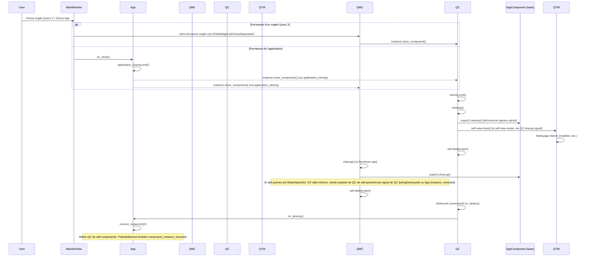

# Plan de Refactorisation de l'Architecture App/AppComponent

**Objectifs :** Améliorer la facilité d'implémentation, prévenir les fuites mémoire, et robustifier la gestion du cycle de vie des composants.

**Propositions Détaillées :**

## 1. Simplification de l'enregistrement des `AppComponent`

*   **Mécanisme :** Utilisation de décorateurs Python.
*   **Description :**
    *   Créer un décorateur `@register_app_component(name, instantiate_on, instantiation_policy)`.
    *   Les classes `AppComponent` utiliseront ce décorateur pour s'auto-enregistrer auprès d'un registre central (potentiellement une nouvelle classe ou un module dédié, pour éviter de surcharger `App`).
    *   `App` consultera ce registre au lieu d'importer et d'appeler manuellement chaque `register_component()` de module.
*   **Avantages :**
    *   Réduction drastique du boilerplate dans `App.register_components()`.
    *   Découplage : les composants déclarent eux-mêmes leurs métadonnées d'enregistrement.
    *   Facilité d'ajout de nouveaux composants (il suffit de les définir et de les décorer).
*   **Inconvénients :**
    *   Nécessite que les modules contenant les composants soient importés au moins une fois pour que les décorateurs s'exécutent (par exemple, via un `import components_pkg` qui importerait tous les modules du package `components`).
*   **Exemple Conceptuel :**
    ```python
    # component_registry.py
    COMPONENT_REGISTRY = {}
    LOGGER = logging.getLogger(__name__) # Assurez-vous d'avoir logging importé

    def register_app_component(name, instantiate_on="demand", instantiation_policy="singleton"):
        def decorator(cls):
            LOGGER.info(f"Registering component {name}...")
            if name in COMPONENT_REGISTRY:
                LOGGER.warning(f"Component {name} already registered. Overwriting.")
            COMPONENT_REGISTRY[name] = {
                "class": cls,
                "instantiate_on": instantiate_on,
                "instantiation_policy": instantiation_policy,
                "module": cls.__module__ # Pour référence
            }
            return cls
        return decorator

    # Dans un module de composant, par exemple, my_component.py
    # from ..app import AppComponent # Ou chemin vers la classe de base
    # from .component_registry import register_app_component # Ou chemin vers le registre

    # @register_app_component("MyNewComponent", instantiate_on="setup", instantiation_policy="singleton")
    # class MyNewComponent(AppComponent):
    #     # ... implémentation ...
    #     pass

    # app.py (modification)
    # from .component_registry import COMPONENT_REGISTRY
    # import importlib
    # import pkgutil

    # class App(qc.QObject):
    #     def _discover_and_register_components(self):
    #         # Supposons un package nommé 'project_components'
    #         # Vous devrez adapter cela à la structure de votre projet
    #         import project_components # Package principal
    #         for importer, modname, ispkg in pkgutil.walk_packages(
    #             path=project_components.__path__,
    #             prefix=project_components.__name__ + '.',
    #             onerror=lambda x: None):
    #             importlib.import_module(modname) # Déclenche les décorateurs

    #         for name, definition in COMPONENT_REGISTRY.items():
    #             self.components[name] = {
    #                 "definition": definition,
    #                 "instances": {},
    #             }
    #
    #     def __init__(self):
    #         # ...
    #         self.components: dict[str, dict[str, Union[dict, AppComponent]]] = {}
    #         self._discover_and_register_components() # Remplacer l'ancien register_components
    #         # ...
    ```

## 2. Robustesse de la gestion du cycle de vie et prévention des fuites mémoire

*   **2.1. Classe de base `AppComponent` améliorée :**
    *   **Gestionnaire de connexions de signaux :**
        *   Fournir des méthodes utilitaires dans `AppComponent` pour enregistrer les connexions de signaux Qt (par exemple, `self.connect_signal(signal_emitter.signal_name, slot_handler)`).
        *   Ces méthodes stockeraient les informations de connexion (émetteur, signal, récepteur, slot).
        *   La méthode `cleanup()` de la classe de base `AppComponent` parcourrait automatiquement ces connexions enregistrées et tenterait de les déconnecter proprement.
        *   **Avantages :** Centralise la logique de déconnexion, réduit le risque d'oubli, simplifie le `cleanup()` des classes filles.
        *   **Inconvénients :** Nécessite une discipline pour utiliser ces méthodes utilitaires au lieu de `connect()` directement.
    *   **Exemple Conceptuel (`AppComponent` amélioré) :**
        ```python
        # import logging # Assurez-vous que logging est importé
        # LOGGER = logging.getLogger(__name__)

        # class AppComponent(qc.QObject):
        #     # ... (signaux broadcast, closing, etc.)
        #     component_name: str = None

        #     def __init__(self, app: App, instance_name: str):
        #         super().__init__(parent=app) # Important de passer le parent pour la hiérarchie QObject
        #         self.app: App = app
        #         self.instance_name = instance_name
        #         self._managed_connections = [] # Liste pour stocker les connexions (émetteur, nom_signal_str, handler)
        #         self.destroyed.connect(self.on_destroy)

        #     def connect_signal(self, signal_emitter, signal_name_str, slot_handler):
        #         """Connecte un signal et enregistre la connexion pour un cleanup automatique."""
        #         try:
        #             signal = getattr(signal_emitter, signal_name_str)
        #             # Tenter de déconnecter d'abord pour éviter les connexions multiples du même slot
        #             try:
        #                 signal.disconnect(slot_handler)
        #             except (TypeError, RuntimeError): # TypeError si jamais connecté, RuntimeError si objet C++ détruit
        #                 pass
        #             signal.connect(slot_handler)
        #             self._managed_connections.append((signal_emitter, signal_name_str, slot_handler))
        #             LOGGER.debug(f"Connected {signal_name_str} from {signal_emitter} to {slot_handler} for {self.instance_name}")
        #         except AttributeError:
        #             LOGGER.error(f"Signal {signal_name_str} not found on {signal_emitter} for {self.instance_name}")
        #         except Exception as e:
        #             LOGGER.error(f"Error connecting signal {signal_name_str} for {self.instance_name}: {e}")

        #     def disconnect_signal(self, signal_emitter, signal_name_str, slot_handler):
        #         """Déconnecte un signal spécifique et le retire de la gestion si présent."""
        #         try:
        #             signal = getattr(signal_emitter, signal_name_str)
        #             signal.disconnect(slot_handler)
        #             LOGGER.debug(f"Disconnected {signal_name_str} from {slot_handler} for {self.instance_name}")
        #         except (TypeError, RuntimeError): # TypeError si pas connecté, RuntimeError si objet C++ détruit
        #             pass # Pas grave si on essaie de déconnecter quelque chose qui ne l'est pas/plus
        #         except Exception as e:
        #             LOGGER.error(f"Error disconnecting signal {signal_name_str} for {self.instance_name}: {e}")
        #         finally:
        #             # Retirer de la liste de gestion si la tentative de déconnexion a été faite
        #             connection_tuple = (signal_emitter, signal_name_str, slot_handler)
        #             if connection_tuple in self._managed_connections:
        #                 self._managed_connections.remove(connection_tuple)

        #     def cleanup(self):
        #         """Nettoyage de base, incluant la déconnexion des signaux gérés."""
        #         LOGGER.debug(f"Base cleanup for {self.instance_name} ({self.__class__.__name__})")
        #         # Déconnecter dans l'ordre inverse de connexion pourrait être plus sûr dans certains cas, mais simple itération ici
        #         for emitter, signal_name, handler in list(self._managed_connections): # list() pour copier car on modifie
        #             try:
        #                 signal_instance = getattr(emitter, signal_name)
        #                 signal_instance.disconnect(handler)
        #                 LOGGER.debug(f"Managed disconnect of {signal_name} from {handler} for {self.instance_name}")
        #             except RuntimeError:
        #                 LOGGER.warning(f"Error during managed disconnect of {signal_name} for {self.instance_name}: emitter/receiver likely deleted.")
        #             except AttributeError:
        #                  LOGGER.warning(f"Error during managed disconnect of {signal_name} for {self.instance_name}: signal attribute not found (object changed?).")
        #             except Exception as e:
        #                 LOGGER.error(f"Unexpected error during managed disconnect of {signal_name} for {self.instance_name}: {e}")
        #         self._managed_connections.clear()
        #         # Les classes filles doivent appeler super().cleanup()

        #     def close_component(self):
        #         LOGGER.debug(f"Closing component {self.instance_name}...")
        #         self.closing.emit() # Permet aux dépendants de se nettoyer d'abord
        #         self.cleanup()
        #         self.deleteLater() # Crucial pour la destruction Qt

        #     def on_destroy(self):
        #         LOGGER.debug(f"Component {self.instance_name} destroyed. Removing from App.")
        #         if self.app: # self.app peut être None si déjà nettoyé
        #             self.app.remove_instance(self)
        #             self.app = None # Rompre le cycle de référence
        #         # Autres nettoyages spécifiques au moment de la destruction si nécessaire
        ```

*   **2.2. Gestion des références enfants par les composants "manager" (ex: `QueryManagerComponent`) :**
    *   **Utilisation de `weakref.WeakValueDictionary` :**
        *   Pour stocker les références aux composants enfants (comme les `QueryComponent` dans `QueryManagerComponent.queries`).
        *   Lorsque la seule référence restante à un enfant est la référence faible, l'enfant peut être collecté par le garbage collector, et la référence faible sera automatiquement retirée du dictionnaire.
        *   **Avantages :** Aide à prévenir les cycles de référence et les fuites si un enfant n'est pas correctement retiré manuellement.
        *   **Inconvénients :**
            *   Le cycle de vie de l'objet devient moins déterministe (dépend du GC).
            *   Nécessite de s'assurer qu'il existe toujours une référence forte quelque part tant que l'objet est activement utilisé (par exemple, le widget de l'onglet dans `QTabWidget` pourrait maintenir une référence forte au `QueryComponent` tant que l'onglet est ouvert).
            *   Peut masquer des erreurs de logique de `cleanup` si on s'y fie trop. Il faut toujours un `cleanup` explicite.
    *   **Patron de Nettoyage Explicite Renforcé :**
        *   S'assurer que `QueryManagerComponent.close_query()` et `QueryManagerComponent.clear()` non seulement appellent `query.close_component()` mais retirent aussi explicitement la référence de `self.queries` (si ce n'est pas un `WeakValueDictionary`).
        *   Le `QueryComponent.on_destroy()` (connecté à `self.destroyed`) devrait notifier son parent (`QueryManagerComponent`) pour qu'il retire la référence, au cas où la destruction est initiée ailleurs. Cela nécessite une référence au parent ou un système de signaux dédié. `QueryComponent` pourrait avoir un signal `beingDestroyed(instance_name)` que le `QueryManagerComponent` connecte lors de la création de la query.

*   **2.3. Stratégies pour la déconnexion systématique des signaux Qt :**
    *   Outre le gestionnaire de connexions dans `AppComponent` (voir 2.1), promouvoir l'utilisation du **contexte de `QObject` pour la déconnexion automatique** lorsque c'est possible. Si un `QObject` (le récepteur) est détruit, Qt déconnecte automatiquement les signaux qui lui sont connectés. Cela fonctionne bien si le récepteur est un enfant du composant dans l'arborescence `QObject`.
    *   Pour les connexions où le récepteur n'est pas un enfant direct ou a un cycle de vie différent, le gestionnaire de connexions manuel (2.1) reste crucial.
    *   **Documentation et exemples clairs** sur les bonnes pratiques de connexion/déconnexion.

## 3. Facilité d'implémentation de nouveaux `AppComponent`

*   **Classe de base `AppComponent` améliorée (voir 2.1) :** Réduit déjà le boilerplate pour le `cleanup`.
*   **Patrons de conception pour la communication inter-composants :**
    *   Le système `broadcast_dispatcher` existant est un bon début. Il pourrait être formalisé avec des types d'actions et des charges utiles (payloads) mieux définis (par exemple, en utilisant des `dataclasses` ou Pydantic pour la validation des payloads).
    *   Pour des interactions plus directes et typées, envisager un **médiateur de services** où les composants peuvent demander des interfaces spécifiques à d'autres composants via `App` ou un registre de services dédié, plutôt que de dépendre uniquement de broadcasts génériques.
*   **Gestion d'état complexe :**
    *   Encourager l'utilisation de modèles de données Qt (`QAbstractItemModel`, etc.) pour les composants qui gèrent des listes ou des arbres de données.
    *   Pour des états plus complexes non directement liés à des vues, l'utilisation de patrons comme "State" ou des machines à états simples pourrait être documentée.

## 4. Impact sur les `QueryComponent` et prévention des fuites

*   **`QueryComponent.cleanup()` amélioré :**
    *   **Doit appeler `super().cleanup()`** pour bénéficier du gestionnaire de connexions de la classe de base.
    *   S'assurer que toutes les ressources créées par `QueryComponent` sont explicitement libérées :
        *   `self.view = None` est déjà présent, mais il faut s'assurer que `QueryTableWidget.close()` (connecté au signal `closing` du `QueryComponent`) nettoie bien ses propres ressources (modèles, vues enfants, etc.) et se déconnecte de tout signal externe.
        *   Libérer les références aux modèles de données s'ils ne sont pas des enfants `QObject` et gérés par la hiérarchie Qt.
        *   Toute autre ressource (par exemple, si des connexions DuckDB étaient maintenues directement dans le composant et non via le Datalake).
*   **Interaction `QueryManagerComponent` / `QueryComponent` :**
    *   Lorsqu'un `QueryComponent` est fermé (par exemple, fermeture de son onglet), il doit signaler sa fermeture à `QueryManagerComponent` pour que ce dernier retire la référence de son dictionnaire `self.queries`.
        *   **Option 1 (Signal dédié) :** `QueryComponent` émet un signal `aboutToBeClosed(self)` ou `instanceAboutToBeRemoved(instance_name)` que `QueryManagerComponent` connecte lors de la création de la query. Dans le slot connecté, `QueryManagerComponent` retire la query de `self.queries`.
        *   **Option 2 (Utilisation de `on_destroy`) :** Le `QueryComponent.on_destroy()` actuel appelle `self.app.remove_instance(self)`. On pourrait modifier `App.remove_instance` pour qu'il émette un signal plus générique `component_instance_removed(component_name, instance_name)` que `QueryManagerComponent` (et d'autres managers) pourraient écouter pour nettoyer leurs propres listes.
    *   L'utilisation de `weakref.WeakValueDictionary` dans `QueryManagerComponent.queries` (voir 2.2) peut servir de filet de sécurité mais ne doit pas remplacer le nettoyage explicite.

## Diagramme Mermaid du flux de fermeture proposé (simplifié) :



**Prochaines étapes (après approbation) :**
1.  Revue de ce plan.
2.  Passer en mode implémentation pour commencer à coder ces changements.